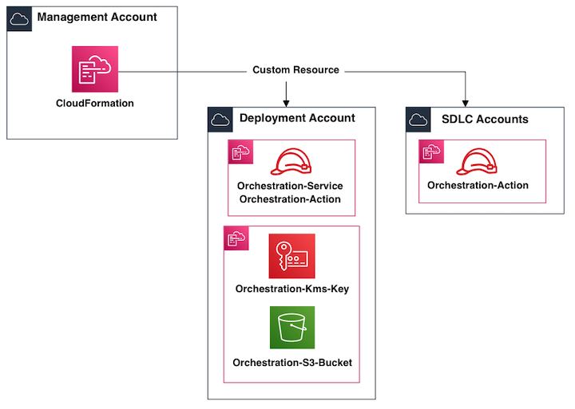

# Software Development Lifecycle - Control Tower Extension

## Description:
This solution will provide the capability to deploying a number of accounts into an AWS Management Account that will be 
under the governance of AWS Control Tower.  The solution uses a number of AWS Services to provision and integrate Software 
Development Lifecycle (SDLC) accounts.  AWS Step Functions is used to watch for the status of the account creation since 
AWS Control Tower is currently serial when creating accounts.  There is additional logic in the solution that will 
search for an existing account creation and will put it in a wait cycle until the initial account creation has completed. 

### AWS Resource Diagram for Account Stack creation
 

### Step Function WorkFlow for Account creation
 

### AWS Resources Diagram for Account Stack integration
 

### Folder Structure

| Folder/File                                             | Description                                                                                                                                                                                                                                                                         |  
|:--------------------------------------------------------|:------------------------------------------------------------------------------------------------------------------------------------------------------------------------------------------------------------------------------------------------------------------------------------|
| cloudformation                                          | Directory for all AWS CloudFormation templates.                                                                                                                                                                                                                                     |
| cloudformation/sam-bootstrap.yaml                       | AWS Cloudformation template that will create the required AWS Resources for the solution to work properly. It will create an IAM Role, KMS Key/Alias and S3 Bucket. All of these AWS Resources are required for an AWS Serverless Application Model (SAM) deployment to successful. |
| cloudformation/codepipeline-example.yaml                | AWS Cloudformation template that shows an example of deploying an SDLC environment structure along with an AWS CodePipeline instance.                                                                                                                                               |
| cloudformation/account-stack-deployment.yaml            | AWS Cloudformation template that shows you how to run the Custom Resources to initiate the Step Function to create the SDLC Accounts.                                                                                                                                               |
| images                                                  | Directory for all diagrams and screenshots to show within README file.                                                                                                                                                                                                              |
| lambdas/custom_resources                                | Directory for all Custom Resource Lambda Functions.                                                                                                                                                                                                                                 |
| lambdas/custom_resources/CTE_CrossAccountCloudFormation | Custom Resource to run in-line cross account CloudFormation template.                                                                                                                                                                                                               |
| lambdas/custom_resources/CTE_InvokeCreateAccountFn      | A Custom Resource that will initiate the Create Account Step Function.                                                                                                                                                                                                              |
| lambdas/layers                                          | Directory for all Lambda Layers.                                                                                                                                                                                                                                                    |
| lambdas/layers/CTE_CfnResponse                          | AWS Lambda Layer that will be used to pass back CloudFormation Results.                                                                                                                                                                                                             |
| lambdas/layers/CTE_Common                               | AWS Lambda Layer that will be used to hold common definitions that could be used across all Lambda Functions.                                                                                                                                                                       |
| lambdas/stepfunctions                                   | Directory for all Lambda Functions that are used within AWS Step Functions.                                                                                                                                                                                                         |
| lambdas/stepfunctions/CTE_CreateAccountFn               | AWS Lambda Function that will use AWS Service Catalog / Control Tower to create an AWS Account.                                                                                                                                                                                     |
| lambdas/stepfunctions/CTE_GetAccountStatusFn            | AWS Lambda Function that will scan the AWS Service Catalog Provisioned Product to see if the account creation has completed.                                                                                                                                                        |
| lambdas/stepfunctions/CTE_SignalCfnResponseFn           | AWS Lambda Function that will sent a SUCCESSFUL or FAILED response back to the initial Lambda function (CTE_CreateAccountFn) from the Step Function.                                                                                                                                |
| scripts                                                 | Directory that has the scripts that will be run to scan / lint / deploy the AWS Lambda Functions.                                                                                                                                                                                   |
| scripts/lint.sh                                         | Shell script that will run the ```pylint``` command against all python files.                                                                                                                                                                                                       |
| scripts/scan.sh                                         | Executes Bandit (python lib) against all python code within the repository to identify any security vulnerabilities.                                                                                                                                                                |
| scripts/sam.sh                                          | Executes a number of SAM commands to package / build / deploy the SAM Function to a specified account.                                                                                                                                                                              | 
| scripts/test.sh                                         | Shell script that will run the ```tox``` command to build a virtual environment and the ```pytest``` command to run any unit tests found in the repository.                                                                                                                         |
| pytest.ini                                              | ini files are the configuration files of the tox project, and can also be used to hold pytest configuration if they have a [pytest] section.                                                                                                                                        |
| requirements.txt                                        | Pip requirements file for deployment environment.                                                                                                                                                                                                                                   |
| test_requirements.txt                                   | Pip requirements file for test environment.                                                                                                                                                                                                                                         |
| tox.ini                                                 | Configured file for Tox. Tox is a command-line driven automated testing tool for Python, based on the use of virtualenv.                                                                                                                                                            |
| .gitignore                                              | Where each line contains a pattern for files/directories to ignore                                                                                                                                                                                                                  |
| .pylintrc                                               | This allows you to specify coding standards on a module-by-module basis                                                                                                                                                                                                             |

## Pre-requisite Steps:
- Control Tower must be turned on in Management Account [Link to AWS Doc](https://docs.aws.amazon.com/controltower/latest/userguide/getting-started-with-control-tower.html)
- Install the Serverless Application Model CLI (SAM) [Link to AWS Doc](https://docs.aws.amazon.com/serverless-application-model/latest/developerguide/serverless-sam-cli-install.html)
- Ensure you have AWS CLI and Console access to the AWS Management Account. Please read disclaimer. 

### ** DISCLAIMER **
This solution will be deployed into your AWS Management Account. The AWS Management Account is a highly sensitive account that should be protected as much as possible using the least 
privileged permission model.  We recommend that customers use a federated role for access *NOT* and  an IAM user.  The required permissions are listed below.  

#### Permissions needed for Setup and Deployment
```json 
{
    "Version": "2012-10-17",
    "Statement": [
        {
            "Sid": "SdlcControlTowerExtension",
            "Effect": "Allow",
            "Action": [
              "cloudformation:CreateChangeSet",
              "cloudformation:CreateStack",
              "cloudformation:DeleteStack",
              "cloudformation:DescribeChangeSet",
              "cloudformation:DescribeStackEvents",
              "cloudformation:DescribeStacks",
              "cloudformation:ExecuteChangeSet",
              "cloudformation:GetTemplateSummary",
              "cloudformation:ListStacks",
              "controltower:DeregisterManagedAccount",
              "controltower:DescribeAccountFactoryConfig",
              "controltower:DescribeManagedAccount",
              "controltower:DescribeManagedOrganizationalUnit",
              "controltower:GetAvailableUpdates",
              "controltower:GetCatastrophicDrift",
              "controltower:GetGuardrailComplianceStatus",
              "controltower:GetHomeRegion",
              "controltower:GetLandingZoneStatus",
              "controltower:ListDriftDetails",
              "controltower:ListEnabledGuardrails",
              "controltower:ListGuardrailViolations",
              "controltower:ListGuardrails",
              "controltower:ListGuardrailsForTarget",
              "controltower:ListManagedAccounts",
              "controltower:ListManagedOrganizationalUnits",
              "controltower:ManageOrganizationalUnit",
              "controltower:PerformPreLaunchChecks",
              "controltower:SetupLandingZone",
              "iam:AttachRolePolicy",
              "iam:CreateRole",
              "iam:DeleteRole",
              "iam:DeleteRolePolicy",
              "iam:DetachRolePolicy",
              "iam:GetRole",
              "iam:GetRolePolicy",
              "iam:GetUser",
              "iam:ListRoleTags",
              "iam:ListRoles",
              "iam:ListUserTags",
              "iam:PassRole",
              "iam:PutRolePolicy",
              "iam:TagRole",
              "iam:TagUser",
              "iam:UntagRole",
              "iam:UntagUser",
              "kms:CreateAlias",
              "kms:CreateGrant",
              "kms:CreateKey",
              "kms:Decrypt",
              "kms:DeleteAlias",
              "kms:DescribeKey",
              "kms:EnableKeyRotation",
              "kms:Encrypt",
              "kms:GenerateDataKey",
              "kms:ScheduleKeyDeletion",
              "lambda:AddPermission",
              "lambda:CreateFunction",
              "lambda:DeleteFunction",
              "lambda:GetFunction",
              "lambda:GetFunctionConfiguration",
              "lambda:InvokeFunction",
              "lambda:ListTags",
              "lambda:RemovePermission",
              "lambda:UpdateFunctionCode",
              "logs:CreateLogGroup",
              "logs:DeleteLogGroup",
              "logs:DescribeLogGroups",
              "logs:DescribeLogStreams",
              "logs:GetLogEvents",
              "logs:PutRetentionPolicy",
              "organizations:CreateOrganizationalUnit",
              "organizations:ListRoots",
              "s3:CreateBucket",
              "s3:DeleteBucket",
              "s3:DeleteBucketPolicy",
              "s3:GetBucketPolicy",
              "s3:GetEncryptionConfiguration",
              "s3:ListAllMyBuckets",
              "s3:ListBucket",
              "s3:PutBucketPolicy",
              "s3:PutBucketPublicAccessBlock",
              "s3:PutBucketVersioning",
              "s3:PutEncryptionConfiguration",
              "s3:PutObject",
              "s3:GetObject",
              "servicecatalog:AssociatePrincipalWithPortfolio",
              "servicecatalog:DescribeProduct",
              "servicecatalog:DescribeProvisioningArtifact",
              "servicecatalog:DescribeProvisionedProduct",
              "servicecatalog:ListPortfolios",
              "servicecatalog:ListAcceptedPortfolioShares",
              "servicecatalog:ListServiceActions",
              "servicecatalog:ListProvisioningArtifacts",
              "servicecatalog:ListServiceActionsForProvisioningArtifact",
              "servicecatalog:ScanProvisionedProducts",
              "servicecatalog:SearchProducts",
              "servicecatalog:SearchProductsAsAdmin",
              "servicecatalog:SearchProvisionedProducts",
              "states:ListActivities",
              "states:ListStateMachines",
              "states:DescribeActivity",
              "states:DescribeExecution",
              "states:DescribeStateMachineForExecution",
              "states:DescribeStateMachine",
              "states:ListExecutions",
              "states:GetExecutionHistory",
              "states:CreateStateMachine",
              "states:DeleteStateMachine",
              "states:TagResource",
              "sts:GetCallerIdentity"
            ],
            "Resource": "*"
        }
    ]
}
```

For this example S3 Bucket Access Logging is not enabled but is recommended that you do so when added to your enterprise.
  
## Deployment Steps:
- Change directory into the repository directory `cd aws-sdlc-controltower-extension-main`.
- Execute the cloudformation/sam-bootstrap.yaml into the AWS Management Account where the AWS Control Tower will live.
  ```bash
  LOCAL_ROLE_ARN=$(aws sts get-caller-identity --query 'Arn' --output text | sed -e 's/assumed-//g' | sed -e 's/\/botocore-session-[0-9]*//g')
  aws cloudformation deploy --stack-name SDLC-ControlTowerExtension-Bootstrap \
    --template-file cloudformation/sam-bootstrap.yaml \
    --parameter-overrides pRoleArn=${LOCAL_ROLE_ARN}\
    --capabilities CAPABILITY_NAMED_IAM
  ```  
- Create ALL required Organizational Units within AWS Control Tower
  
  *Note - Administrator Access is needed to create a registered Organizational Units in Control Tower*
  
    https://docs.aws.amazon.com/controltower/latest/userguide/access-control-overview.html#access-control-resources
    
  1.) Login to AWS Console (Management Account)
  
  2.) Navigate to Control Tower Console
  
  3.) On the left side click on "Organization"
  
    
  
  4.) On the right side click on the "Create resources" drop down. Then select "Create organizational unit".
  
  
  
  5.) Enter in desired Organizational Unit (OU) Name. Then select the Parent OU from the drop down. 
  
   
 
  Repeat these steps until you create all desired Organizational Units.
 
  

- Since this solution builds the SAM function inside Lambda-like container, Docker must be installed and running on your workstation.

### Deploying Serverless Templates
These templates include the AWS StepFunction as well as all the Lambda Functions themselves.  The Lambda Function along 
with the CloudFormation to deploy them **serverless.yaml** are located in the "lambdas" directory.
- Deploy Serverless Application Model function.
  ```bash 
  ./scripts/sam.sh 
  ```

## Custom Resource 
### CTE_InvokeCreateAccountFn
This function will invoke the Step Function that will provision account via Account Vending Machine.

#### Input Parameters / Configuration
* **CreateAccountSfn** (*string*) -- [REQUIRED] 

    The ARN for the Control Tower Extension for Pipeline Factory AWS Step Function.    

* **ServiceCatalogParameters** (*dict*) -- [REQUIRED] 
    
    The AWS Service Catalog parameters that will be used to create an account via AWS Control Tower through AWS Service 
    Catalog.
    
  * **AccountName** (*string*) -- [REQUIRED]
  
    The new managed Account that will be created by AWS Service Catalog / Control Tower.  
  
  * **AccountEmail** (*string*) -- [REQUIRED]
    
    The email address you would like to associate to the root user for the newly created account. This must be unique 
    for each AWS Account.
  
  * **SSOUserFirstName** (*string*) -- [REQUIRED]
  
    SSO user first name.

  * **SSOUserLastName** (*string*) -- [REQUIRED]
  
    SSO user last name.
  
  * **SSOUserEmail** (*string*) -- [REQUIRED]
  
    SSO user email. A new SSO user will be created for this email, if it does not exist. This SSO user will be 
    associated with the new managed Account.
  
  * **ManagedOrganizationalUnit** (*string*) -- [REQUIRED]
  
    Managed organizational unit. The managed Account will be placed under this Organizational Unit.
 
  
#### CloudFormation Example Code [YAML]:
```yaml
Resources:
  rCreateDeplAccount:
    Type: Custom::InvokeCreateAccountFn
    Properties:
      ServiceToken: !Sub arn:aws:lambda:${AWS::Region}:${AWS::AccountId}:function:CTE_InvokeCreateAccountFn
      CreateAccountSfn: !Sub arn:aws:states:${AWS::Region}:${AWS::AccountId}:stateMachine:CTE_SDLC-Integration
      ServiceCatalogParameters:
        AccountName: ent-shrsvc-depl
        AccountEmail: john.doe+1@example.com
        SSOUserFirstName: John
        SSOUserLastName: Doe
        SSOUserEmail: john.doe@example.com
        ManagedOrganizationalUnit: infrastructure:depl

  rCreateProdAccount:
    Type: Custom::InvokeCreateAccountFn
    Properties:
      ServiceToken: !Sub arn:aws:lambda:${AWS::Region}:${AWS::AccountId}:function:CTE_InvokeCreateAccountFn
      CreateAccountSfn: !Sub arn:aws:states:${AWS::Region}:${AWS::AccountId}:stateMachine:CTE_SDLC-Integration
      ServiceCatalogParameters:
        AccountName: ent-shrsvc-prod
        AccountEmail: john.doe+2@example.com
        SSOUserFirstName: John
        SSOUserLastName: Doe
        SSOUserEmail: john.doe@example.com
        ManagedOrganizationalUnit: infrastructure:prod

  rCreateTestAccount:
    Type: Custom::InvokeCreateAccountFn
    Properties:
      ServiceToken: !Sub arn:aws:lambda:${AWS::Region}:${AWS::AccountId}:function:CTE_InvokeCreateAccountFn
      CreateAccountSfn: !Sub arn:aws:states:${AWS::Region}:${AWS::AccountId}:stateMachine:CTE_SDLC-Integration
      ServiceCatalogParameters:
        AccountName: ent-shrsvc-test
        AccountEmail: john.doe+3@example.com
        SSOUserFirstName: John
        SSOUserLastName: Doe
        SSOUserEmail: john.doe@example.com
        ManagedOrganizationalUnit: infrastructure:dev
```

### CTE_CrossAccountCloudFormation
This Custom Resource will allow you to deploy an inline CloudFormation Stack across account.

To reference other logical resources within the inline CloudFormation Template use a prefix of "&" in front of the 
intrinsic function. 

Example:
```bash
# Reference:
{"&Ref": "rLogicalResource1"}

# Substitute
{"&Fn::Sub": "${rLogicalResource2.Arn}/*"}

# Get Attribute
{"&Fn::GetAtt": "rLogicalResource2.Arn"}
```

If you would like to reference an inline CloudFormation template logical resource ensure that an output property is used.  The   

#### Input Parameters / Configuration
* **RoleArn** (*string*) --
  
    The Amazon Resource Name (ARN) of an AWS Identity and Access Management (IAM) role that AWS CloudFormation assumes 
    when running the stack. AWS CloudFormation uses the role's credentials to make calls on your behalf. AWS 
    CloudFormation uses this role for all future operations on the stack. As long as users have permission to operate 
    on the stack, AWS CloudFormation uses this role even if the users don't have permission to pass it. Ensure that 
    the role grants least privilege.
    
    If you don't specify a value, AWS CloudFormation uses the role that was previously associated with the stack. If 
    no role is available, AWS CloudFormation uses a temporary session that is generated from your user credentials. 

* **Capabilities** (*list*) --

    In some cases, you must explicitly acknowledge that your stack template contains certain capabilities in order for 
    AWS CloudFormation to create the stack.

* **StackName** (*string*) -- [REQUIRED] 

    The name or the unique ID of the stack for which you are creating a change set. AWS CloudFormation generates the 
    change set by comparing this stack's information with the information that you submit, such as a modified template 
    or different parameter input values.

* **Description** (*string*) --
    
    A description to help you identify this CloudFormation Stack.

* **TerminationProtection** (*boolean*) --

    Updates termination protection for the specified stack. If a user attempts to delete a stack with termination 
    protection enabled, the operation fails and the stack remains unchanged.

* **Resources** (*dict*) -- [REQUIRED] 

    This section contains reference information for all AWS resource and property types that are supported by 
    AWS CloudFormation. If you would like to use the local account variables prefix the function with a *&*. 
    Examples; {"&Ref": "rOrchestrationKmsKey"} or {"&Fn::Sub": "codepipeline-${AWS::AccountId}-${AWS::Region}"}

* **Outputs** (*dict*) -- 

    The length of time, in minutes, that CloudFormation waits for the nested stack to reach the CREATE_COMPLETE state. 
    The default is no timeout. When CloudFormation detects that the nested stack has reached the CREATE_COMPLETE state, 
    it marks the nested stack resource as CREATE_COMPLETE in the parent stack and resumes creating the parent stack. 
    If the timeout period expires before the nested stack reaches CREATE_COMPLETE, CloudFormation marks the nested 
    stack as failed and rolls back both the nested stack and parent stack.

* **Tags** (*list*) -- 

    Key-value pairs to associate with this stack. AWS CloudFormation also propagates these tags to the resources 
    created in the stack. A maximum number of 50 tags can be specified.

  
#### CloudFormation Example Code [YAML]:
```yaml
Resources:
  rOrchestrationResources:
    Type: Custom::CTE_CrossAccountCloudFormation
    Properties:
      ServiceToken: !Sub arn:aws:lambda:${AWS::Region}:${AWS::AccountId}:function:CTE_CrossAccountCloudFormation
      Parameters:
        Configuration:
          RoleArn: !Sub arn:aws:iam::${rCreateDeplAccount.AccountId}:role/AWSControlTowerExecution
          Capabilities: CAPABILITY_NAMED_IAM
          StackName: Orchestration-Resources
          Description: AWS Resources need for the Deployment environment to setup an SDLC Account Stack
          TerminationProtection: true
          Resources:
            rOrchestrationArtifactBucket:
              Type: AWS::S3::Bucket
              Properties:
                BucketName: {"&Fn::Sub": "codepipeline-${AWS::AccountId}-${AWS::Region}"}
                AccessControl: BucketOwnerFullControl
                PublicAccessBlockConfiguration:
                  BlockPublicAcls: true
                  BlockPublicPolicy: true
                  IgnorePublicAcls: true
                  RestrictPublicBuckets: true
                BucketEncryption:
                  ServerSideEncryptionConfiguration:
                    - ServerSideEncryptionByDefault:
                        KMSMasterKeyID: {"&Ref": "rOrchestrationKmsKey"}
                        SSEAlgorithm: aws:kms
                VersioningConfiguration:
                  Status: Enabled
            rOrchestrationArtifactBucketPolicy:
              Type: AWS::S3::BucketPolicy
              Properties:
                Bucket: {"&Ref": "rOrchestrationArtifactBucket"}
                PolicyDocument:
                  Statement:
                    - Sid: DenyUnEncryptedObjectUploads
                      Effect: Deny
                      Principal: '*'
                      Action: s3:PutObject
                      Resource: {"&Fn::Sub": "${rOrchestrationArtifactBucket.Arn}/*"}
                      Condition:
                        StringNotEquals:
                          s3:x-amz-server-side-encryption: aws:kms
          Outputs:
            oOrchestrationArtifactBucket:
              Value: {"&Ref": "rOrchestrationArtifactBucket"}
Outputs:
  oOrchestrationArtifactBucket:
    Value: !GetAtt rOrchestrationResources.oOrchestrationArtifactBucket
```

## Additional Information
### Common Errors
**Error:**

```bash
An error occurred (ResourceNotFoundException) when calling the DescribeProduct operation: Product with name AWS Control 
Tower Account Factory does not exist or access was denied.
```

**Solution:**

This means that the CTE-SDLC-StepFunctions-rCTECreateAccountFnRole-* and 
CTE-SDLC-StepFunctions-rCTEGetAccountStatusFnRole-* Roles haven't been added to the AWS Service Catalog Portfolio 
(AWS Control Tower Account Factory Portfolio).

### Control Tower Troubleshooting
https://docs.aws.amazon.com/controltower/latest/userguide/troubleshooting.html

### Packages needed for running tests
Packages needed to run Unit Tests

```bash
pip install -r test_requirements.txt
```

## License
This project is licensed under the Apache-2.0 License.
