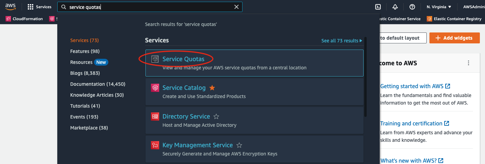
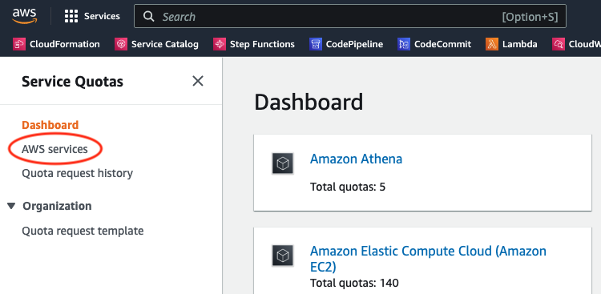
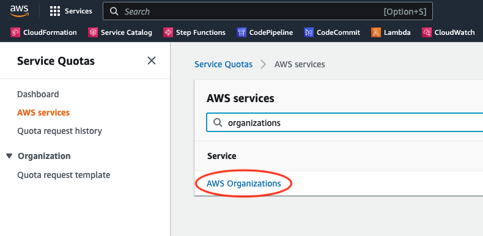
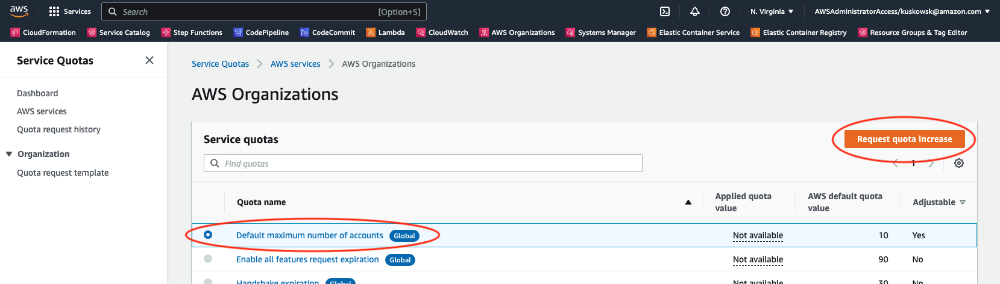
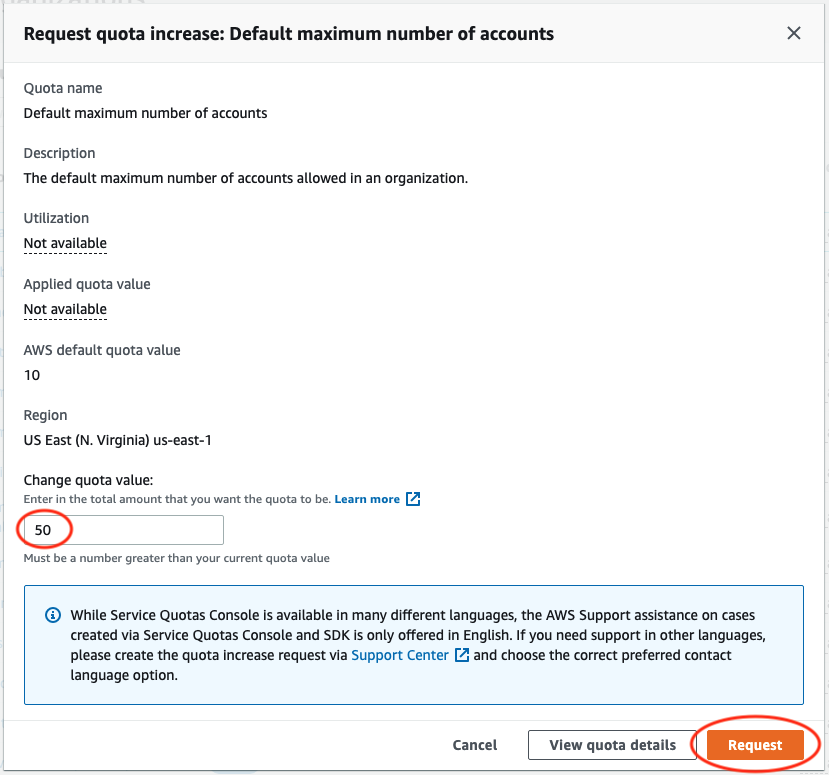

**Error:**

```bash
AWS Control Tower cannot create an account because you have reached the limit on the number of accounts in your organization
```

**Solution:**

Increase the service limit for AWS Organizations "Default maximum number of accounts".

1. Search for "Service Quotas". 


2. Select "AWS services" from the left pane.


3. Search for "AWS Organizations".


4. Select the "Default maximum number of accounts" ratio button, then click the "Request quota increase" button.


5. Under "Change quota value" enter in the desired value, then click on "Request".
 


